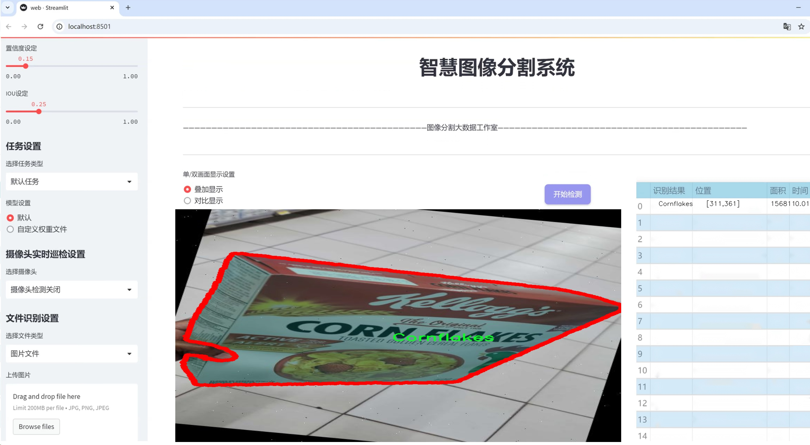
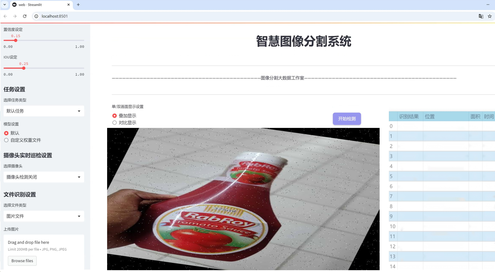

# 食品包装物体分割系统源码＆数据集分享
 [yolov8-seg-swintransformer＆yolov8-seg-LSKNet等50+全套改进创新点发刊_一键训练教程_Web前端展示]

### 1.研究背景与意义

项目参考[ILSVRC ImageNet Large Scale Visual Recognition Challenge](https://gitee.com/YOLOv8_YOLOv11_Segmentation_Studio/projects)

项目来源[AAAI Global Al lnnovation Contest](https://kdocs.cn/l/cszuIiCKVNis)

研究背景与意义

随着全球经济的快速发展和人们生活水平的提高，食品包装的多样性和复杂性日益增加。食品包装不仅是保护食品质量的重要手段，更是品牌形象和消费者体验的重要组成部分。然而，传统的食品包装检测方法往往依赖人工目测或简单的图像处理技术，效率低下且容易出现误判。因此，开发一种高效、准确的食品包装物体分割系统显得尤为重要。

近年来，深度学习技术的迅猛发展为计算机视觉领域带来了革命性的变化，尤其是在物体检测和分割任务中，表现出色的YOLO（You Only Look Once）系列模型已成为研究的热点。YOLOv8作为该系列的最新版本，结合了高效的特征提取和实时处理能力，能够在复杂环境中实现快速而准确的物体检测。然而，尽管YOLOv8在许多应用场景中表现优异，但在特定领域如食品包装物体分割中，仍然存在一定的局限性。为此，基于改进YOLOv8的食品包装物体分割系统的研究具有重要的现实意义。

本研究所使用的数据集包含1100张图像，涵盖20种不同类别的食品包装物体，包括蔬菜、饮料、谷物、调料等。这些类别的多样性不仅反映了市场上食品包装的丰富性，也为模型的训练提供了良好的基础。通过对这些数据的深入分析与处理，可以帮助模型更好地学习到不同类别之间的特征差异，从而提高分割的准确性和鲁棒性。此外，数据集中所包含的多样化样本能够有效地增强模型的泛化能力，使其在实际应用中能够适应不同的环境和条件。

在实际应用中，基于改进YOLOv8的食品包装物体分割系统可以广泛应用于智能零售、自动化仓储、食品安全监测等领域。通过对食品包装的自动识别与分割，不仅可以提高工作效率，降低人工成本，还能够提升消费者的购物体验和满意度。同时，该系统还可以为食品行业的监管提供数据支持，帮助企业及时发现和解决包装问题，确保食品安全。

综上所述，基于改进YOLOv8的食品包装物体分割系统的研究，不仅具有重要的学术价值，也具有广泛的应用前景。通过对该系统的深入研究与开发，可以推动食品包装检测技术的进步，为食品行业的智能化转型提供有力支持。这一研究不仅能够填补现有技术的空白，还将为未来的相关研究提供新的思路和方法，具有重要的理论和实践意义。

### 2.图片演示






##### 注意：由于此博客编辑较早，上面“2.图片演示”和“3.视频演示”展示的系统图片或者视频可能为老版本，新版本在老版本的基础上升级如下：（实际效果以升级的新版本为准）

  （1）适配了YOLOV8的“目标检测”模型和“实例分割”模型，通过加载相应的权重（.pt）文件即可自适应加载模型。

  （2）支持“图片识别”、“视频识别”、“摄像头实时识别”三种识别模式。

  （3）支持“图片识别”、“视频识别”、“摄像头实时识别”三种识别结果保存导出，解决手动导出（容易卡顿出现爆内存）存在的问题，识别完自动保存结果并导出到tempDir中。

  （4）支持Web前端系统中的标题、背景图等自定义修改，后面提供修改教程。

  另外本项目提供训练的数据集和训练教程,暂不提供权重文件（best.pt）,需要您按照教程进行训练后实现图片演示和Web前端界面演示的效果。

### 3.视频演示

[3.1 视频演示](https://www.bilibili.com/video/BV1dd1kYeEUW/)

### 4.数据集信息展示

##### 4.1 本项目数据集详细数据（类别数＆类别名）

nc: 20
names: ['Cabbage', 'Carrot', 'Cornflakes', 'Juice', 'Mango', 'Mazoe', 'Oats', 'Onion', 'Petroleum-Jelly', 'Pfuko-Maheu', 'Pie', 'Potato', 'Tea-bags', 'Toothpaste', 'Yoghurt', 'avocado', 'banana', 'cooking-oil', 'orange', 'tomato']


##### 4.2 本项目数据集信息介绍

数据集信息展示

在本研究中，我们采用了名为“Final year project”的数据集，以支持改进YOLOv8-seg的食品包装物体分割系统的训练。该数据集包含20个不同的类别，涵盖了多种常见的食品包装物体，旨在提高计算机视觉系统在识别和分割食品包装方面的准确性和效率。通过对这些类别的深入分析，我们能够更好地理解和优化模型的性能。

数据集中包含的类别包括：卷心菜（Cabbage）、胡萝卜（Carrot）、玉米片（Cornflakes）、果汁（Juice）、芒果（Mango）、Mazoe饮料、燕麦（Oats）、洋葱（Onion）、石油膏（Petroleum-Jelly）、Pfuko-Maheu饮品、馅饼（Pie）、土豆（Potato）、茶包（Tea-bags）、牙膏（Toothpaste）、酸奶（Yoghurt）、鳄梨（avocado）、香蕉（banana）、食用油（cooking-oil）、橙子（orange）和西红柿（tomato）。这些类别的选择不仅反映了市场上常见的食品包装类型，还考虑到了不同产品的外观特征和包装设计的多样性。

数据集的构建过程注重数据的多样性和代表性，确保每个类别都包含足够的样本，以便模型能够学习到不同包装的特征。每个类别的样本在拍摄时都尽量保持自然光照和真实场景，以减少环境因素对分割效果的影响。这种方法使得数据集在实际应用中具有更高的实用性和有效性。

在训练过程中，YOLOv8-seg模型将利用这些标注好的样本进行学习，目标是提高其在食品包装物体分割任务中的表现。通过精确的标注和丰富的样本，模型能够学习到不同类别之间的细微差别，从而在实际应用中实现更高的分割精度。此外，数据集中的多样性还将帮助模型更好地应对不同环境和条件下的挑战，增强其鲁棒性。

随着食品包装行业的快速发展，自动化的物体分割技术在提高生产效率、降低人工成本方面显得尤为重要。通过使用“Final year project”数据集，我们希望能够推动食品包装物体分割技术的进步，使其在实际应用中更具可行性和有效性。未来的研究将集中在进一步优化模型架构和训练策略，以期在更广泛的应用场景中实现高效的物体分割。

总之，“Final year project”数据集为改进YOLOv8-seg的食品包装物体分割系统提供了坚实的基础，丰富的类别和高质量的样本将为模型的训练和优化提供强有力的支持。通过这一数据集的应用，我们期待在食品包装物体分割领域取得显著的进展，为相关行业的自动化和智能化发展贡献力量。


### 5.全套项目环境部署视频教程（零基础手把手教学）

[5.1 环境部署教程链接（零基础手把手教学）](https://www.bilibili.com/video/BV1jG4Ve4E9t/?vd_source=bc9aec86d164b67a7004b996143742dc)


[5.2 安装Python虚拟环境创建和依赖库安装视频教程链接（零基础手把手教学）](https://www.bilibili.com/video/BV1nA4VeYEze/?vd_source=bc9aec86d164b67a7004b996143742dc)

### 6.手把手YOLOV8-seg训练视频教程（零基础小白有手就能学会）

[6.1 手把手YOLOV8-seg训练视频教程（零基础小白有手就能学会）](https://www.bilibili.com/video/BV1cA4VeYETe/?vd_source=bc9aec86d164b67a7004b996143742dc)


按照上面的训练视频教程链接加载项目提供的数据集，运行train.py即可开始训练



     Epoch   gpu_mem       box       obj       cls    labels  img_size
     1/200     0G   0.01576   0.01955  0.007536        22      1280: 100%|██████████| 849/849 [14:42<00:00,  1.04s/it]
               Class     Images     Labels          P          R     mAP@.5 mAP@.5:.95: 100%|██████████| 213/213 [01:14<00:00,  2.87it/s]
                 all       3395      17314      0.994      0.957      0.0957      0.0843

     Epoch   gpu_mem       box       obj       cls    labels  img_size
     2/200     0G   0.01578   0.01923  0.007006        22      1280: 100%|██████████| 849/849 [14:44<00:00,  1.04s/it]
               Class     Images     Labels          P          R     mAP@.5 mAP@.5:.95: 100%|██████████| 213/213 [01:12<00:00,  2.95it/s]
                 all       3395      17314      0.996      0.956      0.0957      0.0845

     Epoch   gpu_mem       box       obj       cls    labels  img_size
     3/200     0G   0.01561    0.0191  0.006895        27      1280: 100%|██████████| 849/849 [10:56<00:00,  1.29it/s]
               Class     Images     Labels          P          R     mAP@.5 mAP@.5:.95: 100%|███████   | 187/213 [00:52<00:00,  4.04it/s]
                 all       3395      17314      0.996      0.957      0.0957      0.0845


### 7.50+种全套YOLOV8-seg创新点代码加载调参视频教程（一键加载写好的改进模型的配置文件）

[7.1 50+种全套YOLOV8-seg创新点代码加载调参视频教程（一键加载写好的改进模型的配置文件）](https://www.bilibili.com/video/BV1Hw4VePEXv/?vd_source=bc9aec86d164b67a7004b996143742dc)

### 8.YOLOV8-seg图像分割算法原理

原始YOLOv8-seg算法原理

YOLOv8-seg算法是YOLO系列目标检测算法的最新进展，结合了目标检测与图像分割的任务，旨在实现更高效的目标识别与分割效果。该算法在YOLOv5和YOLOv7的基础上进行了多项创新，尤其是在网络结构、特征提取、损失函数及样本匹配策略等方面进行了优化，从而提高了模型的性能和适用性。

首先，YOLOv8-seg的网络结构依然遵循YOLO系列的经典设计，主要由输入层、主干网络（Backbone）、特征融合层（Neck）和解耦头（Head）组成。主干网络部分，YOLOv8采用了CSPDarknet的思想，使用C2f模块替代了YOLOv5中的C3模块。这一变化不仅保持了模型的轻量化特性，还在特征提取的精度上没有妥协。C2f模块的设计灵感来源于YOLOv7的ELAN结构，具备更好的梯度流动性，能够有效缓解深层网络中的梯度消失问题。C2f模块通过引入多个分支结构，使得网络在提取特征时能够同时利用不同路径的信息，从而获得更丰富的特征表示。

在特征融合层，YOLOv8-seg采用了PAN-FPN结构，这一结构能够实现多尺度特征的深度融合，增强了网络对不同尺寸目标的检测能力。通过自下而上的特征融合，YOLOv8-seg能够有效整合浅层、中层和高层特征，使得网络在处理复杂场景时具备更强的鲁棒性和准确性。此外，YOLOv8-seg还对上采样过程进行了优化，去除了YOLOv5中不必要的卷积层，直接将高层特征与中层特征进行拼接，从而提升了特征融合的效率。

在解耦头部分，YOLOv8-seg引入了Anchor-Free的目标检测思想，彻底抛弃了传统的Anchor-Base方法。这一创新使得模型在预测目标位置时不再依赖于预定义的锚框，而是通过回归方式直接预测目标的边界框。这种方法的优势在于，网络能够更快地聚焦于目标的实际位置，避免了锚框选择和调整带来的复杂性。同时，YOLOv8-seg的解耦头将分类和回归任务分开处理，使得每个任务能够更加专注，从而有效提升了模型在复杂场景下的定位精度和分类准确性。

损失函数方面，YOLOv8-seg采用了VFLLoss作为分类损失，并结合DFLLoss和CIoULoss来优化回归损失。这种组合损失函数的设计考虑到了样本不平衡问题，尤其是在目标较小或占比不大的情况下，能够有效提升模型的学习能力。此外，YOLOv8-seg在样本匹配策略上进行了创新，由静态匹配转变为Task-Aligned的Assigner匹配方式，这一策略使得模型在训练过程中能够更好地适应不同任务的需求，提高了训练效率和效果。

在数据预处理阶段，YOLOv8-seg采用了YOLOv5的增强策略，包括马赛克增强、混合增强、空间扰动和颜色扰动等多种手段。这些增强方法的引入，不仅丰富了训练样本的多样性，还提升了模型的泛化能力，使得YOLOv8-seg在实际应用中能够更好地适应各种复杂环境。

YOLOv8-seg的设计目标是实现高效、快速的目标检测与分割，特别是在实时性要求较高的场景中表现出色。通过一系列的结构优化和算法创新，YOLOv8-seg在训练时间和检测精度上均取得了显著提升，模型的权重文件也相较于之前的YOLO系列进一步轻量化，使得其能够部署在各种嵌入式设备上，满足实时检测的需求。

综上所述，YOLOv8-seg算法通过对网络结构的创新、特征融合的优化、损失函数的改进以及样本匹配策略的调整，展现了其在目标检测与分割任务中的强大能力。随着YOLOv8-seg的不断发展和应用，其在计算机视觉领域的影响力将愈加显著，为相关研究和实际应用提供了新的思路和方向。


### 9.系统功能展示（检测对象为举例，实际内容以本项目数据集为准）

图9.1.系统支持检测结果表格显示

  图9.2.系统支持置信度和IOU阈值手动调节

  图9.3.系统支持自定义加载权重文件best.pt(需要你通过步骤5中训练获得)

  图9.4.系统支持摄像头实时识别

  图9.5.系统支持图片识别

  图9.6.系统支持视频识别

  图9.7.系统支持识别结果文件自动保存

  图9.8.系统支持Excel导出检测结果数据


### 10.50+种全套YOLOV8-seg创新点原理讲解（非科班也可以轻松写刊发刊，V11版本正在科研待更新）

#### 10.1 由于篇幅限制，每个创新点的具体原理讲解就不一一展开，具体见下列网址中的创新点对应子项目的技术原理博客网址【Blog】：


[10.1 50+种全套YOLOV8-seg创新点原理讲解链接](https://gitee.com/qunmasj/good)

#### 10.2 部分改进模块原理讲解(完整的改进原理见上图和技术博客链接)
### YOLOv8简介
YOLO（You Only Look Once）是一种流行的对象检测和图像分割模型，由华盛顿大学的Joseph Redmon和Ali Farhadi开发。YOLO于2015年推出，以其高速度和高精度迅速走红。

YOLOv2于2016年发布，通过合并批处理规范化、锚盒和维度集群来改进原始模型
2018年推出的YOLOv3使用更高效的骨干网络、多个锚点和空间金字塔池进一步增强了该模型的性能
YOLOv4于2020年发布，引入了Mosaic数据增强、新的无锚检测头和新的丢失功能等创新
YOLOv5进一步提高了模型的性能，并添加了超参数优化、集成实验跟踪和自动导出到流行导出格式等新功能
YOLOv6于2022年由美团开源，目前正在该公司的许多自动配送机器人中使用
YOLOv7在COCO关键点数据集上添加了额外的任务，如姿态估计
YOLOv8是Ultralytics公司推出的YOLO的最新版本。作为一款尖端、最先进的（SOTA）车型，YOLOv8在之前版本的成功基础上，引入了新的功能和改进，以增强性能、灵活性和效率。YOLOv8支持全方位的视觉AI任务，包括检测、分割、姿态估计、跟踪和分类。这种多功能性允许用户在不同的应用程序和域中利用YOLOv8的功能
#### YOLOv8的新特性与可用模型

Ultralytics 并没有直接将开源库命名为 YOLOv8，而是直接使用 ultralytics 这个词，原因是 ultralytics 将这个库定位为算法框架，而非某一个特定算法，一个主要特点是可扩展性。其希望这个库不仅仅能够用于 YOLO 系列模型，而是能够支持非 YOLO 模型以及分类分割姿态估计等各类任务。总而言之，ultralytics 开源库的两个主要优点是：

融合众多当前 SOTA 技术于一体
未来将支持其他 YOLO 系列以及 YOLO 之外的更多算法
Ultralytics为YOLO模型发布了一个全新的存储库。它被构建为 用于训练对象检测、实例分割和图像分类模型的统一框架。

提供了一个全新的 SOTA 模型，包括 P5 640 和 P6 1280 分辨率的目标检测网络和基于 YOLACT 的实例分割模型。和 YOLOv5 一样，基于缩放系数也提供了 N/S/M/L/X 尺度的不同大小模型，用于满足不同场景需求
骨干网络和 Neck 部分可能参考了 YOLOv7 ELAN 设计思想，将 YOLOv5 的 C3 结构换成了梯度流更丰富的 C2f 结构，并对不同尺度模型调整了不同的通道数，属于对模型结构精心微调，不再是无脑一套参数应用所有模型，大幅提升了模型性能。不过这个 C2f 模块中存在 Split 等操作对特定硬件部署没有之前那么友好了
Head 部分相比 YOLOv5 改动较大，换成了目前主流的解耦头结构，将分类和检测头分离，同时也从 Anchor-Based 换成了 Anchor-Free
Loss 计算方面采用了 TaskAlignedAssigner 正样本分配策略，并引入了 Distribution Focal Loss
训练的数据增强部分引入了 YOLOX 中的最后 10 epoch 关闭 Mosiac 增强的操作，可以有效地提升精度
YOLOv8 还高效灵活地支持多种导出格式，并且该模型可以在 CPU 和 GPU 上运行。YOLOv8 模型的每个类别中有五个模型用于检测、分割和分类。YOLOv8 Nano 是最快和最小的，而 YOLOv8 Extra Large (YOLOv8x) 是其中最准确但最慢的。


### FocalModulation模型的基本原理
参考该博客，Focal Modulation Networks（FocalNets）的基本原理是替换自注意力（Self-Attention）模块，使用焦点调制（focal modulation）机制来捕捉图像中的长距离依赖和上下文信息。下图是自注意力和焦点调制两种方法的对比。


自注意力要求对每个查询令牌（Query Token）与其他令牌进行复杂的查询-键（Query-Key）交互和查询-值（Query-Value）聚合，以计算注意力分数并捕捉上下文。而焦点调制则先将空间上下文以不同粒度聚合到调制器中，然后以查询依赖的方式将这些调制器注入到查询令牌中。焦点调制简化了交互和聚合操作，使其更轻量级。在图中，自注意力部分使用红色虚线表示查询-键交互和黄色虚线表示查询-值聚合，而焦点调制部分则用蓝色表示调制器聚合和黄色表示查询-调制器交互。 

FocalModulation模型通过以下步骤实现：

1. 焦点上下文化：用深度卷积层堆叠来编码不同范围的视觉上下文。


2. 门控聚合：通过门控机制，选择性地将上下文信息聚合到每个查询令牌的调制器中。


3. 逐元素仿射变换：将聚合后的调制器通过仿射变换注入到每个查询令牌中。

下面来分别介绍这三个机制->

#### 焦点上下文化
焦点上下文化（Focal Contextualization）是焦点调制（Focal Modulation）的一个组成部分。焦点上下文化使用一系列深度卷积层（depth-wise convolutional layers）来编码不同范围内的视觉上下文信息。这些层可以捕捉从近处到远处的视觉特征，从而允许网络在不同层次上理解图像内容。通过这种方式，网络能够在聚合上下文信息时保持对局部细节的敏感性，并增强对全局结构的认识。


​

这张图详细比较了自注意力（Self-Attention, SA）和焦点调制（Focal Modulation）的机制，并特别展示了焦点调制中的上下文聚合过程。左侧的图展示了自注意力模型如何通过键（k）和查询（q）之间的交互，以及随后的聚合来生成输出。而中间和右侧的图说明了焦点调制如何通过层级化的上下文聚合和门控聚合过程替代自注意力模型的这一过程。在焦点调制中，输入首先通过轻量级线性层进行处理，然后通过层级化的上下文化模块和门控机制来选择性地聚合信息，最终通过调制器与查询（q）进行交互以生成输出。

#### 门控聚合
在Focal Modulation Networks（FocalNets）中的 "门控聚合"（Gated Aggregation）是关键组件之一，这一过程涉及使用门控机制来选择性地聚合上下文信息。以下是这个过程的详细分析：

1. 什么是门控机制？
门控机制在深度学习中常用于控制信息流。它通常用于决定哪些信息应该被传递，哪些应该被阻断。在循环神经网络（RNN）中，特别是在长短期记忆网络（LSTM）和门控循环单元（GRU）中，门控机制用于调节信息在时间序列数据中的流动。

2. 门控聚合的目的
在FocalNets中，门控聚合的目的是为每个查询令牌（即处理中的数据单元）选择性地聚合上下文信息。这意味着网络能够决定哪些特定的上下文信息对于当前处理的查询令牌是重要的，从而专注于那些最相关的信息。

3. 如何实现门控聚合？
实现门控聚合可能涉及一系列计算步骤，其中包括：

计算上下文信息：这可能涉及使用深度卷积层（如文中提到的）对输入图像的不同区域进行编码，以捕捉从局部到全局的视觉上下文。
门控操作：这一步骤涉及到一个决策过程，根据当前查询令牌的特征来决定哪些上下文信息是相关的。这可能通过一个学习到的权重（门）来实现，该权重决定了不同上下文信息的重要性。
信息聚合：最后，根据门控操作的结果，选择性地聚合上下文信息到一个调制器中。这个调制器随后被用于调整或“调制”查询令牌的表示。
4. 门控聚合的好处
通过门控聚合，FocalNets能够更有效地聚焦于对当前任务最关键的信息。这种方法提高了模型的效率和性能，因为它减少了不必要信息的处理，同时增强了对关键特征的关注。在视觉任务中，这可能意味着更好的目标检测和图像分类性能，特别是在复杂或多变的视觉环境中。

总结：门控聚合是FocalNets的一个核心组成部分，它通过选择性地集中处理重要的上下文信息来提升网络的效率和性能。

#### 逐元素仿射变换
在Focal Modulation Networks（FocalNets）中的第三个关键组件是逐元素仿射变换，这个步骤涉及将通过门控聚合得到的调制器注入到每个查询令牌中。以下是该过程的详细分析：

1. 仿射变换的基本概念：
仿射变换是一种线性变换，用于对数据进行缩放、旋转、平移和倾斜等操作。在深度学习中，逐元素的仿射变换通常指的是对每个元素进行线性变换，这种变换可以被描述为y = ax + b，其中x是输入，y是输出，a和b是变换的参数。

2. 逐元素仿射变换的作用：
在FocalNets中，逐元素仿射变换的作用是将聚合后的调制器信息注入到每个查询令牌中。这个步骤对于整合上下文信息和查询令牌的原始特征非常重要。通过这种方式，调制器所包含的上下文信息可以直接影响查询令牌的表示。

3. 执行仿射变换：
执行这一步骤时，聚合后的调制器对每个查询令牌进行逐元素的仿射变换。在实践中，这可能意味着对查询令牌的每个特征应用调制器中的相应权重（a）和偏差（b）。这样，调制器中的每个元素都直接对应于查询令牌的一个特征，通过调整这些特征来改变其表达。

4. 仿射变换的效果：
通过逐元素仿射变换，模型能够更细致地调整每个查询令牌的特征，根据上下文信息来增强或抑制某些特征。这种精细的调整机制允许网络更好地适应复杂的视觉场景，提高对细节的捕捉能力，从而提升了模型在各种视觉任务中的性能，如目标检测和图像分类。

总结：逐元素仿射变换它使得模型能够利用上下文信息来有效地调整查询令牌，增强了模型对关键视觉特征的捕捉和表达能力。


### 11.项目核心源码讲解（再也不用担心看不懂代码逻辑）

#### 11.1 ultralytics\models\yolo\pose\__init__.py

以下是对提供代码的逐行分析和核心部分的保留，以及详细的中文注释：

```python
# Ultralytics YOLO 🚀, AGPL-3.0 license

# 从当前包中导入PosePredictor、PoseTrainer和PoseValidator类
from .predict import PosePredictor
from .train import PoseTrainer
from .val import PoseValidator

# 定义该模块的公共接口，包含PoseTrainer、PoseValidator和PosePredictor
__all__ = 'PoseTrainer', 'PoseValidator', 'PosePredictor'
```

### 代码分析与注释

1. **导入模块**：
   - `from .predict import PosePredictor`：从当前包的`predict`模块中导入`PosePredictor`类，可能用于姿态预测的功能。
   - `from .train import PoseTrainer`：从当前包的`train`模块中导入`PoseTrainer`类，可能用于训练姿态模型的功能。
   - `from .val import PoseValidator`：从当前包的`val`模块中导入`PoseValidator`类，可能用于验证姿态模型的功能。

2. **定义公共接口**：
   - `__all__ = 'PoseTrainer', 'PoseValidator', 'PosePredictor'`：定义了模块的公共接口，表示当使用`from module import *`时，只有这三个类会被导入。这是一种控制模块导出内容的方式，有助于隐藏内部实现细节。

### 核心部分总结
- 该代码的核心部分是导入姿态相关的三个类，并定义了模块的公共接口。这样做的目的是为了方便用户使用这些类，同时保持模块的结构清晰。

这个文件是Ultralytics YOLO项目中的一个初始化文件，位于`ultralytics/models/yolo/pose/`目录下。它的主要功能是定义模块的公共接口，并导入与姿态估计相关的类。

首先，文件开头有一个注释，表明这是Ultralytics YOLO项目的一部分，并指出该项目遵循AGPL-3.0许可证。这意味着该代码是开源的，用户可以自由使用和修改，但在分发修改后的版本时需要遵循相同的许可证条款。

接下来，文件通过相对导入的方式引入了三个类：`PosePredictor`、`PoseTrainer`和`PoseValidator`。这些类分别负责姿态预测、模型训练和验证。这种结构使得模块化的设计更加清晰，便于管理和维护。

最后，`__all__`变量被定义为一个包含字符串的元组，列出了模块中希望公开的类名。这意味着当使用`from module import *`语句时，只会导入这些指定的类。这是一种控制模块导出内容的方式，有助于避免命名冲突和保护内部实现细节。

总的来说，这个文件在Ultralytics YOLO的姿态估计模块中起到了组织和管理类的作用，使得其他模块可以方便地使用这些功能。

#### 11.2 ultralytics\utils\downloads.py

以下是代码中最核心的部分，并附上详细的中文注释：

```python
import requests
from pathlib import Path
from zipfile import ZipFile, is_zipfile
from tqdm import tqdm  # 进度条库

def safe_download(url, file=None, dir=None, unzip=True, delete=False, retry=3, progress=True):
    """
    从指定的 URL 下载文件，并可选择解压和删除下载的文件。

    参数:
        url (str): 要下载的文件的 URL。
        file (str, optional): 下载文件的文件名。如果未提供，将使用 URL 的文件名。
        dir (str, optional): 保存下载文件的目录。如果未提供，将保存在当前工作目录。
        unzip (bool, optional): 是否解压下载的文件。默认: True。
        delete (bool, optional): 是否在解压后删除下载的文件。默认: False。
        retry (int, optional): 下载失败时重试的次数。默认: 3。
        progress (bool, optional): 是否在下载过程中显示进度条。默认: True。
    """
    # 确定下载文件的保存路径
    f = Path(dir) / (file if file else url.split('/')[-1])  # 如果提供了 dir，则使用 dir 和 file 组合路径

    # 检查文件是否已经存在
    if not f.is_file():  # 如果文件不存在，则开始下载
        desc = f"Downloading {url} to '{f}'"
        print(desc)  # 打印下载信息
        f.parent.mkdir(parents=True, exist_ok=True)  # 创建目录（如果不存在）

        for i in range(retry + 1):  # 尝试下载，最多重试 retry 次
            try:
                # 使用 requests 下载文件
                response = requests.get(url, stream=True)
                response.raise_for_status()  # 检查请求是否成功

                # 获取文件总大小以便显示进度条
                total_size = int(response.headers.get('Content-Length', 0))
                with open(f, 'wb') as file_handle:
                    for data in tqdm(response.iter_content(chunk_size=1024), total=total_size // 1024, unit='KB', disable=not progress):
                        file_handle.write(data)  # 写入文件

                break  # 下载成功，退出循环
            except Exception as e:
                if i == retry:  # 如果重试次数用尽，抛出异常
                    raise ConnectionError(f'下载失败: {url}') from e

    # 解压文件（如果需要）
    if unzip and f.exists() and f.suffix in ('.zip', '.tar', '.gz'):
        if is_zipfile(f):
            with ZipFile(f, 'r') as zip_ref:
                zip_ref.extractall(f.parent)  # 解压到同一目录
        if delete:
            f.unlink()  # 删除下载的文件

# 示例调用
# safe_download('https://example.com/file.zip', dir='downloads', unzip=True)
```

### 代码说明：
1. **导入必要的库**：导入 `requests` 用于网络请求，`Path` 用于处理文件路径，`ZipFile` 用于解压缩文件，`tqdm` 用于显示下载进度条。
  
2. **定义 `safe_download` 函数**：该函数负责从指定的 URL 下载文件，并提供解压和删除文件的选项。

3. **文件路径处理**：根据提供的目录和文件名生成下载文件的完整路径。如果未提供文件名，则从 URL 中提取文件名。

4. **下载文件**：使用 `requests.get` 方法下载文件，并通过 `tqdm` 显示下载进度。若下载失败，则根据重试次数进行重试。

5. **解压文件**：如果下载的文件是压缩文件（如 `.zip`、`.tar`、`.gz`），则进行解压。

6. **删除文件**：如果设置了 `delete` 参数为 `True`，则在解压后删除下载的文件。

### 示例调用：
可以通过调用 `safe_download` 函数并传入相应的参数来下载文件，例如下载一个 zip 文件并解压到指定目录。

这个程序文件 `ultralytics/utils/downloads.py` 是用于处理文件下载、解压和管理的工具类，主要应用于 Ultralytics YOLO 项目中。文件的核心功能包括从 URL 下载文件、检查文件的有效性、解压缩文件、处理 Google Drive 链接、检查磁盘空间等。

首先，文件导入了一些必要的库，包括 `contextlib`、`re`、`shutil`、`subprocess`、`requests` 和 `torch` 等。这些库提供了文件操作、网络请求、正则表达式处理等功能。

接下来，定义了一些常量，如 `GITHUB_ASSETS_REPO` 和 `GITHUB_ASSETS_NAMES`，这些常量列出了在 GitHub 上维护的模型文件的名称，便于后续下载和管理。

文件中包含多个函数，功能各异：

1. **is_url**：检查给定字符串是否为有效的 URL，并可选地检查该 URL 是否存在。
2. **delete_dsstore**：删除指定目录下的 `.DS_Store` 文件，这些文件是 macOS 系统生成的隐藏文件，可能在不同操作系统间传输时造成问题。
3. **zip_directory**：将指定目录的内容压缩为 ZIP 文件，支持排除特定文件，并可以显示压缩进度。
4. **unzip_file**：解压缩 ZIP 文件到指定路径，支持排除特定文件，并可以创建新的目录以存放解压内容。
5. **check_disk_space**：检查下载文件所需的磁盘空间是否充足，确保在下载之前有足够的空间。
6. **get_google_drive_file_info**：从 Google Drive 的分享链接中提取直接下载链接和文件名，处理下载限制问题。
7. **safe_download**：从给定 URL 下载文件，支持重试、解压和删除下载后的文件等功能。
8. **get_github_assets**：从指定的 GitHub 仓库获取发布版本和资产列表。
9. **attempt_download_asset**：尝试从 GitHub 下载指定的文件，如果本地不存在则进行下载。
10. **download**：支持并发下载多个文件，利用线程池实现高效下载。

整体而言，这个文件为 Ultralytics YOLO 项目提供了强大的文件管理功能，确保用户能够方便地下载和处理模型文件，处理文件的有效性和兼容性问题，提升了用户体验。

#### 11.3 ui.py

以下是经过简化和注释的核心代码部分：

```python
import sys
import subprocess

def run_script(script_path):
    """
    使用当前 Python 环境运行指定的脚本。

    Args:
        script_path (str): 要运行的脚本路径

    Returns:
        None
    """
    # 获取当前 Python 解释器的路径
    python_path = sys.executable

    # 构建运行命令，使用 streamlit 运行指定的脚本
    command = f'"{python_path}" -m streamlit run "{script_path}"'

    # 执行命令，并等待其完成
    result = subprocess.run(command, shell=True)
    
    # 检查命令执行的返回码，如果不为0则表示出错
    if result.returncode != 0:
        print("脚本运行出错。")

# 程序入口
if __name__ == "__main__":
    # 指定要运行的脚本路径
    script_path = "web.py"  # 这里可以直接指定脚本名称

    # 调用函数运行脚本
    run_script(script_path)
```

### 代码注释说明：
1. **导入模块**：
   - `sys`：用于获取当前 Python 解释器的路径。
   - `subprocess`：用于执行外部命令。

2. **函数 `run_script`**：
   - 接受一个参数 `script_path`，表示要运行的 Python 脚本的路径。
   - 使用 `sys.executable` 获取当前 Python 解释器的路径，以确保在正确的环境中运行脚本。
   - 构建一个命令字符串，使用 `streamlit` 运行指定的脚本。
   - 使用 `subprocess.run` 执行命令，并等待其完成。
   - 检查命令的返回码，如果返回码不为0，表示脚本运行出错，打印错误信息。

3. **程序入口**：
   - 使用 `if __name__ == "__main__":` 确保代码仅在直接运行时执行。
   - 指定要运行的脚本路径为 `web.py`。
   - 调用 `run_script` 函数执行脚本。

这个程序文件的主要功能是使用当前的 Python 环境来运行一个指定的脚本，具体来说是一个名为 `web.py` 的脚本。程序首先导入了必要的模块，包括 `sys`、`os` 和 `subprocess`，以及一个自定义的 `abs_path` 函数，用于获取文件的绝对路径。

在 `run_script` 函数中，首先获取当前 Python 解释器的路径，这样可以确保在正确的环境中运行脚本。接着，构建一个命令字符串，这个命令会调用 `streamlit` 模块来运行指定的脚本。`streamlit` 是一个用于构建数据应用的库，因此这个程序的目的是启动一个基于 `streamlit` 的应用。

使用 `subprocess.run` 方法来执行构建好的命令，`shell=True` 参数表示命令将在一个新的 shell 中执行。执行后，程序会检查返回码，如果返回码不为零，表示脚本运行过程中出现了错误，程序会打印出相应的错误信息。

在文件的最后部分，使用 `if __name__ == "__main__":` 语句来确保只有在直接运行该文件时才会执行后面的代码。在这里，程序指定了要运行的脚本路径（通过 `abs_path` 函数获取 `web.py` 的绝对路径），然后调用 `run_script` 函数来执行这个脚本。

总体来说，这个程序的结构清晰，功能明确，主要用于启动一个 `streamlit` 应用。

#### 11.4 ultralytics\nn\modules\head.py

以下是代码中最核心的部分，并附上详细的中文注释：

```python
import torch
import torch.nn as nn

class Detect(nn.Module):
    """YOLOv8 检测头，用于目标检测模型。"""
    
    def __init__(self, nc=80, ch=()):
        """初始化 YOLOv8 检测层，指定类别数和通道数。
        
        参数:
            nc (int): 类别数，默认值为 80。
            ch (tuple): 输入通道数的元组。
        """
        super().__init__()
        self.nc = nc  # 类别数
        self.nl = len(ch)  # 检测层的数量
        self.reg_max = 16  # DFL 通道数
        self.no = nc + self.reg_max * 4  # 每个锚点的输出数量
        self.stride = torch.zeros(self.nl)  # 在构建过程中计算的步幅
        c2, c3 = max((16, ch[0] // 4, self.reg_max * 4)), max(ch[0], min(self.nc, 100))  # 通道数
        # 定义两个卷积序列 cv2 和 cv3
        self.cv2 = nn.ModuleList(
            nn.Sequential(Conv(x, c2, 3), Conv(c2, c2, 3), nn.Conv2d(c2, 4 * self.reg_max, 1)) for x in ch)
        self.cv3 = nn.ModuleList(nn.Sequential(Conv(x, c3, 3), Conv(c3, c3, 3), nn.Conv2d(c3, self.nc, 1)) for x in ch)
        self.dfl = DFL(self.reg_max) if self.reg_max > 1 else nn.Identity()  # DFL层或恒等层

    def forward(self, x):
        """连接并返回预测的边界框和类别概率。
        
        参数:
            x (list): 输入特征图列表。
        
        返回:
            y (tensor): 包含边界框和类别概率的张量。
        """
        shape = x[0].shape  # BCHW 格式
        for i in range(self.nl):
            # 将 cv2 和 cv3 的输出拼接
            x[i] = torch.cat((self.cv2[i](x[i]), self.cv3[i](x[i])), 1)
        
        # 如果是训练模式，直接返回
        if self.training:
            return x
        
        # 动态锚点或形状变化时，重新计算锚点和步幅
        self.anchors, self.strides = (x.transpose(0, 1) for x in make_anchors(x, self.stride, 0.5))
        self.shape = shape

        # 将特征图拼接成一个张量
        x_cat = torch.cat([xi.view(shape[0], self.no, -1) for xi in x], 2)
        box, cls = x_cat.split((self.reg_max * 4, self.nc), 1)  # 分割边界框和类别概率
        dbox = dist2bbox(self.dfl(box), self.anchors.unsqueeze(0), xywh=True, dim=1) * self.strides  # 计算边界框

        # 将边界框和类别概率合并
        y = torch.cat((dbox, cls.sigmoid()), 1)
        return y  # 返回最终的预测结果

class Classify(nn.Module):
    """YOLOv8 分类头，将输入特征图转换为类别预测。"""

    def __init__(self, c1, c2, k=1, s=1, p=None, g=1):
        """初始化 YOLOv8 分类头，指定输入输出通道、卷积核大小、步幅等参数。
        
        参数:
            c1 (int): 输入通道数。
            c2 (int): 输出通道数。
            k (int): 卷积核大小，默认值为 1。
            s (int): 步幅，默认值为 1。
            p (int): 填充，默认值为 None。
            g (int): 分组数，默认值为 1。
        """
        super().__init__()
        c_ = 1280  # 特征图通道数
        self.conv = Conv(c1, c_, k, s, p, g)  # 卷积层
        self.pool = nn.AdaptiveAvgPool2d(1)  # 自适应平均池化层
        self.drop = nn.Dropout(p=0.0, inplace=True)  # Dropout 层
        self.linear = nn.Linear(c_, c2)  # 全连接层

    def forward(self, x):
        """执行前向传播，返回类别预测。
        
        参数:
            x (tensor): 输入特征图。
        
        返回:
            x (tensor): 类别预测结果。
        """
        if isinstance(x, list):
            x = torch.cat(x, 1)  # 如果输入是列表，则拼接
        x = self.linear(self.drop(self.pool(self.conv(x)).flatten(1)))  # 通过卷积、池化、Dropout 和全连接层
        return x if self.training else x.softmax(1)  # 如果是训练模式，返回原始输出，否则返回 softmax 结果
```

### 代码核心部分说明：
1. **Detect 类**：实现了 YOLOv8 的检测头，负责处理输入特征图并生成边界框和类别概率。它包含了卷积层的定义和前向传播逻辑。
2. **Classify 类**：实现了 YOLOv8 的分类头，将输入特征图转换为类别预测，包含卷积、池化和全连接层的定义。

这些部分是 YOLOv8 模型的关键组成部分，负责处理输入数据并生成模型的输出。

这个程序文件是Ultralytics YOLO（You Only Look Once）模型的一部分，主要实现了模型的头部模块，包括目标检测、分割、姿态估计和分类等功能。文件中定义了多个类，每个类对应不同的任务。

首先，`Detect`类是YOLOv8的检测头，负责生成目标检测的输出。它的构造函数接受类别数量和通道数作为参数，并初始化了一些必要的参数，如输出的数量、特征通道等。在前向传播方法中，输入经过多个卷积层处理后，生成边界框和类别概率。动态生成锚框和步幅信息，确保模型能够适应不同输入尺寸。

接下来，`Segment`类继承自`Detect`，用于分割任务。它在初始化时增加了掩膜和原型的数量，并定义了处理掩膜系数的卷积层。在前向传播中，除了生成检测输出外，还会生成掩膜系数和原型。

`Pose`类同样继承自`Detect`，用于姿态估计。它初始化时定义了关键点的形状，并在前向传播中生成关键点的预测结果。

`Classify`类是YOLOv8的分类头，负责将输入的特征图转换为类别预测。它通过卷积层、池化层和全连接层进行处理，最终输出类别概率。

最后，`RTDETRDecoder`类实现了实时可变形Transformer解码器，结合了Transformer架构和可变形卷积，用于生成边界框和类别标签。它包含多个模块，负责输入特征的投影、解码器的构建以及去噪处理。前向传播中，它将输入特征通过解码器进行处理，输出最终的预测结果。

整体来看，这个文件实现了YOLOv8模型的不同任务头部，利用深度学习中的卷积神经网络和Transformer架构，提供了高效的目标检测、分割、姿态估计和分类功能。每个类的设计都考虑了特定任务的需求，并通过模块化的方式实现了代码的可复用性和可扩展性。

#### 11.5 ultralytics\utils\benchmarks.py

以下是代码中最核心的部分，并附上详细的中文注释：

```python
import time
import pandas as pd
from ultralytics import YOLO
from ultralytics.utils import select_device, check_yolo

def benchmark(model='yolov8n.pt', imgsz=160, device='cpu', verbose=False):
    """
    基准测试YOLO模型在不同格式下的速度和准确性。

    参数:
        model (str): 模型文件的路径，默认为'yolov8n.pt'。
        imgsz (int): 用于基准测试的图像大小，默认为160。
        device (str): 运行基准测试的设备，可以是'cpu'或'cuda'，默认为'cpu'。
        verbose (bool): 如果为True，则在基准测试失败时抛出异常，默认为False。

    返回:
        df (pandas.DataFrame): 包含每种格式的基准测试结果的数据框，包括文件大小、指标和推理时间。
    """
    
    # 设置Pandas显示选项
    pd.options.display.max_columns = 10
    pd.options.display.width = 120
    
    # 选择设备
    device = select_device(device, verbose=False)
    
    # 加载模型
    model = YOLO(model)

    results = []  # 存储结果的列表
    start_time = time.time()  # 记录开始时间
    
    # 遍历导出格式
    for i, (name, format, suffix, cpu, gpu) in export_formats().iterrows():
        emoji, filename = '❌', None  # 默认导出状态为失败
        try:
            # 检查导出格式的兼容性
            if 'cpu' in device.type:
                assert cpu, 'CPU不支持此推理'
            if 'cuda' in device.type:
                assert gpu, 'GPU不支持此推理'

            # 导出模型
            if format == '-':
                filename = model.ckpt_path or model.cfg  # PyTorch格式
            else:
                filename = model.export(imgsz=imgsz, format=format, device=device, verbose=False)
                assert suffix in str(filename), '导出失败'
            emoji = '✅'  # 导出成功

            # 进行推理
            model.predict('bus.jpg', imgsz=imgsz, device=device)

            # 验证模型
            results_dict = model.val(data='coco8.yaml', batch=1, imgsz=imgsz, device=device)
            metric, speed = results_dict.results_dict['mAP'], results_dict.speed['inference']
            results.append([name, emoji, round(file_size(filename), 1), round(metric, 4), round(speed, 2)])
        except Exception as e:
            if verbose:
                raise e  # 抛出异常
            results.append([name, emoji, None, None, None])  # 记录失败的结果

    # 打印结果
    check_yolo(device=device)  # 打印系统信息
    df = pd.DataFrame(results, columns=['Format', 'Status', 'Size (MB)', 'Metric', 'Inference time (ms/im)'])
    
    # 记录基准测试完成信息
    print(f'\n基准测试完成，结果如下:\n{df}\n')
    
    return df
```

### 代码说明：
1. **导入必要的库**：引入了时间处理、数据处理（Pandas）和YOLO模型相关的库。
2. **benchmark函数**：这是主要的基准测试函数，接受模型路径、图像大小、设备类型和详细模式作为参数。
3. **设备选择**：使用`select_device`函数选择运行设备（CPU或GPU）。
4. **模型加载**：使用YOLO类加载指定的模型。
5. **结果存储**：初始化一个列表来存储每种格式的测试结果。
6. **导出格式遍历**：遍历支持的导出格式，进行模型导出和推理测试。
7. **错误处理**：在导出或推理过程中，如果发生异常，根据`verbose`参数决定是否抛出异常或记录失败信息。
8. **结果打印**：使用Pandas DataFrame格式化并打印基准测试结果。

这个代码片段是YOLO模型基准测试的核心部分，主要关注模型的导出和推理性能。

这个程序文件 `ultralytics/utils/benchmarks.py` 是用于基准测试 YOLO 模型在不同格式下的速度和准确性。文件中包含了两个主要的功能：`benchmark` 函数和 `ProfileModels` 类。

首先，`benchmark` 函数的主要目的是对指定的 YOLO 模型进行基准测试。它接受多个参数，包括模型路径、数据集、图像大小、是否使用半精度或整型精度、设备类型（CPU 或 GPU）以及是否详细输出结果。函数内部会根据指定的模型格式进行导出，并在导出后对模型进行预测和验证，计算出每种格式的文件大小、准确性指标和推理时间。最后，结果会以 pandas DataFrame 的形式返回，并记录在日志文件中。

在函数内部，首先会选择设备并加载模型。接着，通过遍历不同的导出格式，进行模型的导出和预测。对于每种格式，函数会进行一系列的验证，确保模型在特定设备上可以正常运行，并记录下每种格式的性能指标。如果在测试过程中出现错误，函数会记录错误信息并继续进行其他格式的测试。

接下来是 `ProfileModels` 类，它用于对多个模型进行性能分析。该类初始化时接受模型路径、定时运行次数、预热运行次数、最小运行时间、图像大小等参数。`profile` 方法会对指定路径下的模型文件进行遍历，加载模型并导出为 ONNX 和 TensorRT 格式，然后分别对这两种格式进行性能分析，计算出推理时间和标准差，并生成结果表格。

在性能分析过程中，类内部会执行预热运行以提高准确性，并在多次运行后计算平均时间和标准差。最终，分析结果会以表格形式输出，方便用户对不同模型的性能进行比较。

整个文件的设计使得用户可以方便地对 YOLO 模型进行基准测试和性能分析，帮助开发者选择最适合的模型格式和配置，以达到最佳的推理性能。

#### 11.6 train.py

以下是经过简化和注释的核心代码部分：

```python
import os
import torch
import yaml
from ultralytics import YOLO  # 导入YOLO模型

if __name__ == '__main__':  # 确保该模块被直接运行时才执行以下代码
    # 设置训练参数
    workers = 1  # 数据加载的工作进程数
    batch = 8  # 每个批次的样本数量
    device = "0" if torch.cuda.is_available() else "cpu"  # 检查是否有可用的GPU

    # 获取数据集配置文件的绝对路径
    data_path = abs_path(f'datasets/data/data.yaml', path_type='current')  

    # 读取YAML文件，保持原有顺序
    with open(data_path, 'r') as file:
        data = yaml.load(file, Loader=yaml.FullLoader)

    # 修改数据集中训练、验证和测试集的路径
    if 'train' in data and 'val' in data and 'test' in data:
        directory_path = os.path.dirname(data_path.replace(os.sep, '/'))  # 获取目录路径
        data['train'] = directory_path + '/train'  # 更新训练集路径
        data['val'] = directory_path + '/val'      # 更新验证集路径
        data['test'] = directory_path + '/test'    # 更新测试集路径

        # 将修改后的数据写回YAML文件
        with open(data_path, 'w') as file:
            yaml.safe_dump(data, file, sort_keys=False)

    # 加载YOLO模型，使用指定的配置文件和预训练权重
    model = YOLO(r"C:\codeseg\codenew\50+种YOLOv8算法改进源码大全和调试加载训练教程（非必要）\改进YOLOv8模型配置文件\yolov8-seg-C2f-Faster.yaml").load("./weights/yolov8s-seg.pt")

    # 开始训练模型
    results = model.train(
        data=data_path,  # 指定训练数据的配置文件路径
        device=device,  # 指定训练设备
        workers=workers,  # 指定数据加载的工作进程数
        imgsz=640,  # 输入图像的大小
        epochs=100,  # 训练的轮数
        batch=batch,  # 每个批次的样本数量
    )
```

### 代码注释说明：
1. **导入必要的库**：导入了处理文件路径、深度学习框架、YAML文件读取和YOLO模型的库。
2. **设置训练参数**：定义了数据加载的工作进程数、批次大小和设备类型（GPU或CPU）。
3. **获取数据集配置文件路径**：使用自定义函数获取数据集的YAML配置文件的绝对路径。
4. **读取和修改YAML文件**：读取YAML文件内容，并更新训练、验证和测试集的路径，确保它们指向正确的目录。
5. **加载YOLO模型**：根据指定的配置文件和预训练权重加载YOLO模型。
6. **开始训练模型**：调用模型的训练方法，传入数据路径、设备、工作进程数、图像大小、训练轮数和批次大小等参数。

这个程序文件 `train.py` 是一个用于训练 YOLO（You Only Look Once）模型的脚本，主要使用了 PyTorch 框架和 YOLOv8 的实现。以下是对代码的逐行讲解。

首先，程序导入了一些必要的库，包括 `os`、`torch`、`yaml` 和 `matplotlib`，以及 `ultralytics` 中的 YOLO 模型。`matplotlib` 被设置为使用 `TkAgg` 后端，以便于可视化。

在 `if __name__ == '__main__':` 语句下，程序开始执行主要逻辑。首先，设置了一些训练参数，包括 `workers`（工作进程数量）和 `batch`（每个批次的样本数量），这里设置为 8。接着，程序检查是否有可用的 GPU，如果有，则将设备设置为 "0"（表示第一个 GPU），否则使用 CPU。

接下来，程序通过 `abs_path` 函数获取数据集配置文件 `data.yaml` 的绝对路径，并将路径中的分隔符统一为 Unix 风格。然后，使用 `os.path.dirname` 获取该文件的目录路径。

程序打开 `data.yaml` 文件并读取其内容，使用 `yaml` 库保持原有的顺序。读取后，程序检查 YAML 文件中是否包含 `train`、`val` 和 `test` 三个键。如果存在，这些键的值将被修改为相应的训练、验证和测试数据的目录路径，并将修改后的内容写回到 YAML 文件中。

在模型加载部分，程序使用 YOLOv8 的配置文件加载模型。这里指定了一个特定的模型配置文件 `yolov8-seg-C2f-Faster.yaml`，并加载了预训练的权重文件 `yolov8s-seg.pt`。需要注意的是，程序中提到不同模型的大小和设备要求可能不同，因此在使用时需要根据实际情况选择合适的模型。

最后，程序调用 `model.train()` 方法开始训练模型。训练时指定了数据配置文件的路径、设备、工作进程数量、输入图像的大小（640x640）、训练的 epoch 数量（100）以及每个批次的大小（8）。

整体来看，这个脚本是一个典型的深度学习训练脚本，主要用于设置训练参数、加载数据和模型，并开始训练过程。

### 12.系统整体结构（节选）

### 整体功能和构架概括

Ultralytics YOLO项目是一个用于目标检测、分割和姿态估计的深度学习框架。其整体架构由多个模块组成，每个模块负责特定的功能。项目的核心功能包括模型的定义、训练、推理、性能评估和文件管理等。以下是对各个文件功能的总结：

- **模型定义**：包括模型的结构和头部模块，负责处理不同的任务（如检测、分割、姿态估计）。
- **训练**：提供训练脚本，设置训练参数，加载数据和模型，并执行训练过程。
- **推理和验证**：处理模型的推理和验证，确保模型的准确性和性能。
- **文件管理**：处理文件的下载、解压和管理，确保所需资源的可用性。
- **基准测试**：评估模型在不同格式下的性能，帮助用户选择最佳的模型配置。
- **可视化和用户界面**：提供用户界面以便于用户与模型交互。

### 文件功能整理表

| 文件路径                                             | 功能描述                                               |
|-----------------------------------------------------|--------------------------------------------------------|
| `ultralytics/models/yolo/pose/__init__.py`         | 定义姿态估计模块的公共接口，导入相关类。               |
| `ultralytics/utils/downloads.py`                   | 处理文件下载、解压和管理，包括从 GitHub 和 Google Drive 下载文件。 |
| `ui.py`                                            | 启动基于 Streamlit 的用户界面应用。                    |
| `ultralytics/nn/modules/head.py`                   | 定义 YOLO 模型的头部模块，包括检测、分割、姿态估计和分类功能。 |
| `ultralytics/utils/benchmarks.py`                  | 进行模型的基准测试和性能分析，评估不同格式的模型性能。   |
| `train.py`                                         | 设置训练参数，加载数据和模型，并执行模型训练过程。      |
| `ultralytics/models/fastsam/val.py`                | 处理 FastSAM 模型的验证过程，评估模型性能。             |
| `ultralytics/models/fastsam/model.py`              | 定义 FastSAM 模型的结构和功能。                          |
| `ultralytics/nn/backbone/lsknet.py`                | 实现 LSKNet 网络结构，作为模型的主干网络。               |
| `ultralytics/utils/callbacks/raytune.py`           | 提供与 Ray Tune 结合的回调函数，用于超参数优化。         |
| `ultralytics/models/sam/modules/transformer.py`    | 实现 SAM 模型中的 Transformer 模块。                     |
| `ultralytics/nn/extra_modules/kernel_warehouse.py` | 提供额外的内核模块，可能用于模型的特定功能或优化。       |
| `demo_test_camera.py`                               | 提供摄像头测试的示例，展示模型在实时视频流中的应用。      |

这个表格概述了每个文件的功能，帮助理解 Ultralytics YOLO 项目的整体架构和各个模块之间的关系。

注意：由于此博客编辑较早，上面“11.项目核心源码讲解（再也不用担心看不懂代码逻辑）”中部分代码可能会优化升级，仅供参考学习，完整“训练源码”、“Web前端界面”和“50+种创新点源码”以“14.完整训练+Web前端界面+50+种创新点源码、数据集获取”的内容为准。

### 13.图片、视频、摄像头图像分割Demo(去除WebUI)代码

在这个博客小节中，我们将讨论如何在不使用WebUI的情况下，实现图像分割模型的使用。本项目代码已经优化整合，方便用户将分割功能嵌入自己的项目中。
核心功能包括图片、视频、摄像头图像的分割，ROI区域的轮廓提取、类别分类、周长计算、面积计算、圆度计算以及颜色提取等。
这些功能提供了良好的二次开发基础。

### 核心代码解读

以下是主要代码片段，我们会为每一块代码进行详细的批注解释：

```python
import random
import cv2
import numpy as np
from PIL import ImageFont, ImageDraw, Image
from hashlib import md5
from model import Web_Detector
from chinese_name_list import Label_list

# 根据名称生成颜色
def generate_color_based_on_name(name):
    ......

# 计算多边形面积
def calculate_polygon_area(points):
    return cv2.contourArea(points.astype(np.float32))

...
# 绘制中文标签
def draw_with_chinese(image, text, position, font_size=20, color=(255, 0, 0)):
    image_pil = Image.fromarray(cv2.cvtColor(image, cv2.COLOR_BGR2RGB))
    draw = ImageDraw.Draw(image_pil)
    font = ImageFont.truetype("simsun.ttc", font_size, encoding="unic")
    draw.text(position, text, font=font, fill=color)
    return cv2.cvtColor(np.array(image_pil), cv2.COLOR_RGB2BGR)

# 动态调整参数
def adjust_parameter(image_size, base_size=1000):
    max_size = max(image_size)
    return max_size / base_size

# 绘制检测结果
def draw_detections(image, info, alpha=0.2):
    name, bbox, conf, cls_id, mask = info['class_name'], info['bbox'], info['score'], info['class_id'], info['mask']
    adjust_param = adjust_parameter(image.shape[:2])
    spacing = int(20 * adjust_param)

    if mask is None:
        x1, y1, x2, y2 = bbox
        aim_frame_area = (x2 - x1) * (y2 - y1)
        cv2.rectangle(image, (x1, y1), (x2, y2), color=(0, 0, 255), thickness=int(3 * adjust_param))
        image = draw_with_chinese(image, name, (x1, y1 - int(30 * adjust_param)), font_size=int(35 * adjust_param))
        y_offset = int(50 * adjust_param)  # 类别名称上方绘制，其下方留出空间
    else:
        mask_points = np.concatenate(mask)
        aim_frame_area = calculate_polygon_area(mask_points)
        mask_color = generate_color_based_on_name(name)
        try:
            overlay = image.copy()
            cv2.fillPoly(overlay, [mask_points.astype(np.int32)], mask_color)
            image = cv2.addWeighted(overlay, 0.3, image, 0.7, 0)
            cv2.drawContours(image, [mask_points.astype(np.int32)], -1, (0, 0, 255), thickness=int(8 * adjust_param))

            # 计算面积、周长、圆度
            area = cv2.contourArea(mask_points.astype(np.int32))
            perimeter = cv2.arcLength(mask_points.astype(np.int32), True)
            ......

            # 计算色彩
            mask = np.zeros(image.shape[:2], dtype=np.uint8)
            cv2.drawContours(mask, [mask_points.astype(np.int32)], -1, 255, -1)
            color_points = cv2.findNonZero(mask)
            ......

            # 绘制类别名称
            x, y = np.min(mask_points, axis=0).astype(int)
            image = draw_with_chinese(image, name, (x, y - int(30 * adjust_param)), font_size=int(35 * adjust_param))
            y_offset = int(50 * adjust_param)

            # 绘制面积、周长、圆度和色彩值
            metrics = [("Area", area), ("Perimeter", perimeter), ("Circularity", circularity), ("Color", color_str)]
            for idx, (metric_name, metric_value) in enumerate(metrics):
                ......

    return image, aim_frame_area

# 处理每帧图像
def process_frame(model, image):
    pre_img = model.preprocess(image)
    pred = model.predict(pre_img)
    det = pred[0] if det is not None and len(det)
    if det:
        det_info = model.postprocess(pred)
        for info in det_info:
            image, _ = draw_detections(image, info)
    return image

if __name__ == "__main__":
    cls_name = Label_list
    model = Web_Detector()
    model.load_model("./weights/yolov8s-seg.pt")

    # 摄像头实时处理
    cap = cv2.VideoCapture(0)
    while cap.isOpened():
        ret, frame = cap.read()
        if not ret:
            break
        ......

    # 图片处理
    image_path = './icon/OIP.jpg'
    image = cv2.imread(image_path)
    if image is not None:
        processed_image = process_frame(model, image)
        ......

    # 视频处理
    video_path = ''  # 输入视频的路径
    cap = cv2.VideoCapture(video_path)
    while cap.isOpened():
        ret, frame = cap.read()
        ......
```


### 14.完整训练+Web前端界面+50+种创新点源码、数据集获取


# [下载链接：https://mbd.pub/o/bread/ZpyWmZlt](https://mbd.pub/o/bread/ZpyWmZlt)